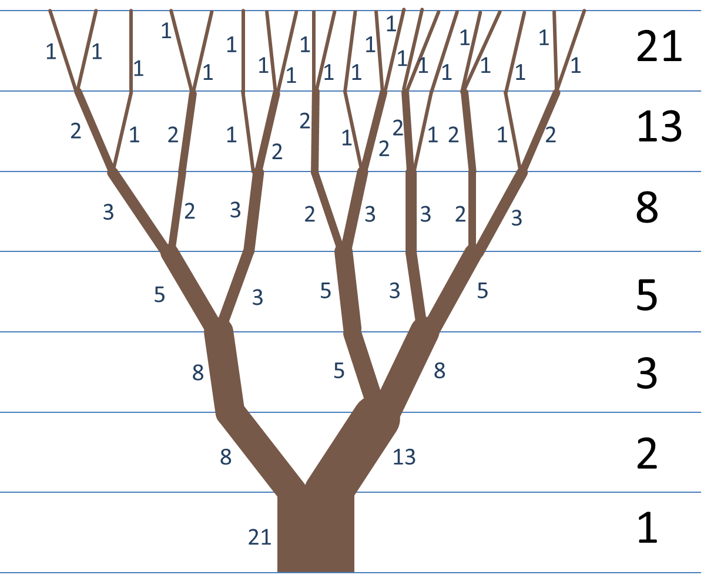

# ¿Qué es la sucesión de Fibonacci?

La sucesión de Fibonacci, es una sucesión de números que se construye a partir de un 0 y un 1 y luego los siguientes números se obtienen sumando los dos números anteriores, un ejemplo de esto sería el de las ramas de los árboles.



```js
const fib = [0, 1, 2, 3, 5, 8, 13, 21, 34, 55];
```
